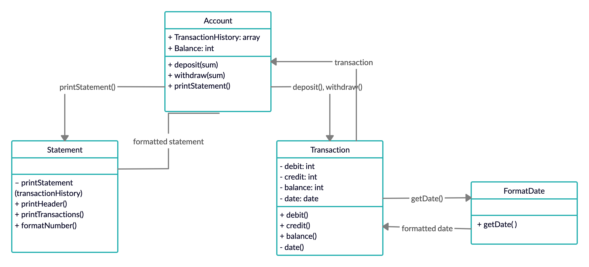
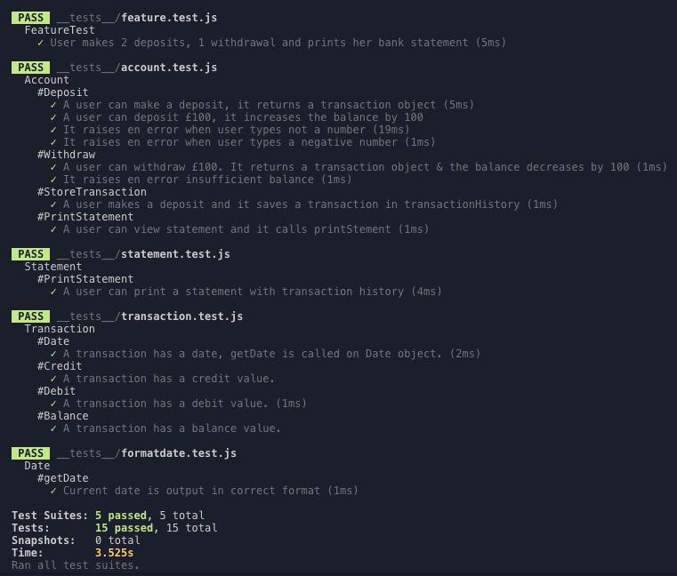
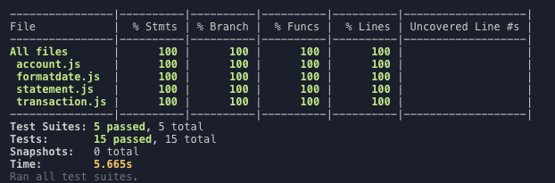

# Bank Tech Test (Week 10 at Makers Academy)

A command line app that can help user create bank account, make deposits, withdraw money and print the account statement.
<br><br>

## How to Install

Describe how to install and run your code and tests.

Clone the repo and in the project folder run:

```
npm install
```

<br><br>

## How to Use

1. In command line run `node`
2. Initialise the main module:

```
const Account = recuire('./src/account.js')
```

3. Create a new bank account:

```
a = new Account
```

4. To deposit money type (e.g. 100)

```
a.deposit(100)
```

5. To withdraw money type (e.g. 150)

```
a.deposit(150)
```

6. To view account statement type

```
a.showStatement()
```

<br><br>

## User Stories

```
As a User
So that I can store my money
I would like to be able to make a deposit
```

```
As a User
So that I user my money
I would like to be able to withdraw my money
```

```
As a User
So that I know how much money I have
I would like to print my account statement
```

```
As a User
So that I know the detail activity
I would like statement to show dates, amount of transaction and final balance
```

<br><br>

## Approach

Every class has a single responsibility that can be described with one sentence:

__Account__ is the main interface for interaction with the bank account.

__Transaction__ stores transaction details(date, credit, debit, balance).

__Format Date__ records and formats the date of transaction.

__Statement__ formats transaction history into a printable format.




<br><br>

## Tests

To run tests type

```
npm test
```

To view test coverage run

```
npx jest --coverage
```


<br><br>

